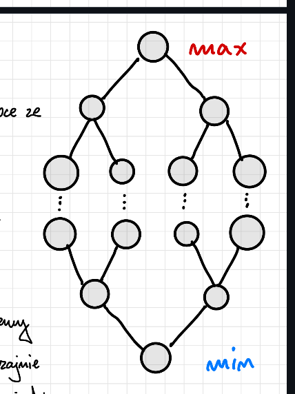

# Zadanie 1 / Lista 1

Napisz w pseudokodzie procedury:

a) przywracania porządku

b) usuwania minimum

c) usuwania maksimum

z kopca minimaksowego. Przyjmij, że elementy tego kopca pamiętane są w jednej tablicy (określ
w jakiej kolejności). Użyj pseudokodu na takim samym poziomie szczegółowości, na jakim
zostały napisane w Notatce nr 2 odpowiednie procedury dla zwykłego kopca.

## Kopiec min-maxowy - definicja z wykładu

Zacznijmy od tego - czym w ogóle jest kopiec min-maxowy?

Jest to struktura łącząca zalety kopca min i kopca max. Pozwala na znalezienie największego i najmniejszego elementu w czasie $O(1)$, a także na dodawanie i usuwanie elementów w czasie $O(\log n)$. Można go zbudować w $O(n)$. 

- Wykorzystujemy dwa kopce: L i H
- W kopcu H pamiętamy roof(n/2) elementów, a w kopcu L floor(n/2)
- Kopiec L uporządkowany jest malejąco, a kopiec H rosnąco
- Na uporządkowanie z poprzedniego punktu nakładamy dodatkowy warunek. Otóż w kopcach H i L w naturalny sposób zdefiniowane są ścieżki biegnące od korzenia kopca L do korzenia kopca H. Chcemy, by na każdej takiej ścieżce klucze były uporządkowane niemalejąco.

## Jak działa przechowywanie tego
- [H1, L1, H1.1, L1.1, H1.2, L1.2,...]

#### Dla kopca H:
- Ojciec: i
- Syn 1: 2i + 1
- Syn 2: 2i + 3

#### Dla kopca L:
- Ojciec: i
- Syn 1: 2i
- Syn 2: 2i + 2

#### Uogólnione:
- Ojciec: i
- Syn 1: 2i + (i mod 2)
- Syn 2: 2i + 2 + (i mod 2)


### Usuwanie minimum

```py
def usuń_min(T[1..n]):
    min = T[2]
    T[2] = T[u] # u to ostatni element w tabeli
    przesun_nizej(T[1..n], 2)
```

### Usuwanie maksimum

```py
def usuń_max(T[1..n]):
    max = T[2]
    T[1] = T[u] # u to ostatni element w tabeli
    przesun_nizej(T[1..n], 2)
```



### Przywracanie porządku

```py
def przesuń_niżej(T[1..n], i)
    k = i
    x = i % 2
    if x == 1
        do
            j = k
            parent = j/2 % 2 == j % 2 ? j/2 : j/2-1
            if j > 2 and T[parent] < T[k]
                k = parent
            swap(T[j], T[k])
        while j == k
    else
        do
            j = k
            parent = j/2 % 2 == j % 2 ? j/2 : j/2-1
            if j > 2 and T[parent] > T[k]
                k = parent
            swap(T[parent], T[j])
        while j == k
```

```py
def przesuń_wyżej(T[1..n], i)
    k = i
    x = i % 2
    if x == 1 # dla kopca H
        do
            j = k
            if 2j + x <= n and T[2j+x] > T[k]
                k = 2j + x
            if 2j + 2 + x <= n and T[2j + 2 + x] > T[k]
                k = 2j + 2 + x
            swap(T[j], T[k])
        while j == k

        if 2k + x > n # przesunięcie do kopca L
            if k < n and T[k] < T[k+1]
                swap(T[k], T[k+1])
                przesuń_wyżej(T[1..n], k+1)
            else
                i = k + 1
                następny = i / 2 % 2 == i%2 ? i/2 : i/2 - 1
                if T[k] < T[następny]
                    swap(T[k], T[następny])
                    przesuń_wyżej(T[1..n], następny)
    else # dla kopca L
        do
            j = k
            if 2j + x <= n and T[2j+x] < T[k]
                k = 2j + x
            if 2j + 2 + x <= n and T[2j + 2 + x] < T[k]
                k = 2j + 2 + x
            swap(T[j], T[k])
        while j == k

        if 2k + x > n # Przesunięcie do kopca H
            if k > 1 and T[k] > T[k-1] and n % 2 == 0
                swap(T[k], T[k-1])
                przesuń_wyżej(T[1..n], k-1)
        else if n % 2 != 0
            if T[k] > T [2k-1]
                swap(T[k], T[2k-1])
                przesuń_niżej(T[1..n], 2k-1)
```