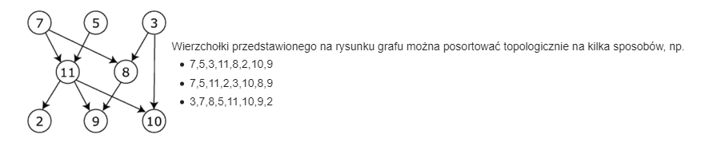

# Zadanie 3 / Lista 1

Porządkiem topologicznym wierzchołków acyklicznego digrafu G = (V, E) nazywamy taki liniowy porządek jego wierzchołków, w którym początek każdej krawędzi występuje przed jej
końcem. Jeśli wierzchołki z V utożsamimy z początkowymi liczbami naturalnymi to każdy ich
porządek liniowy można opisać permutacją liczb 1, 2, , ..., |V| 

W szczególności pozwala to na porównywanie leksykograficzne porządków.
Ułóż algorytm, który dla danego acyklicznego digrafu znajduje pierwszy leksykograficznie porządek topologiczny.

## Przykład sortowań


## Algorytm

Podobny był na mdlu, tylko bez topologicznej najmniejszości -> tylko sortujemy listę

```py
# Na wejściu mamy graf w postaci list sąsiedstwa
# Chcemy algorytm -> O(V + E)

# Generujemy posortowaną listę wierzchołków bez krawędzi 
# posortowaną (np. poprzez listę booli, lecimy po krawędziach 
# i dla odp. wierzcholka bool = true jesli jest wchodzaca, po 
# czym bierzemy indeksy false)

def toposort(G[]):
    res = []

    Q = generateQ() # posortowana lista wierzchołków bez krawędzi wchodzących

    # Bierzemy 1. element z listy, wrzucamy do wyniku
    while Q.length > 0:
        v = Q.pop()
        R.push(v)

        # Usuń każdą krawędź wychodzącą z v
        for e in Q:
            G[v][e].delete()
            if G[v].length == 0:
                Q.push(e)

    # Cykl
    for i = 0..n:
        if G[i].length() > 0 return false

    return res
```