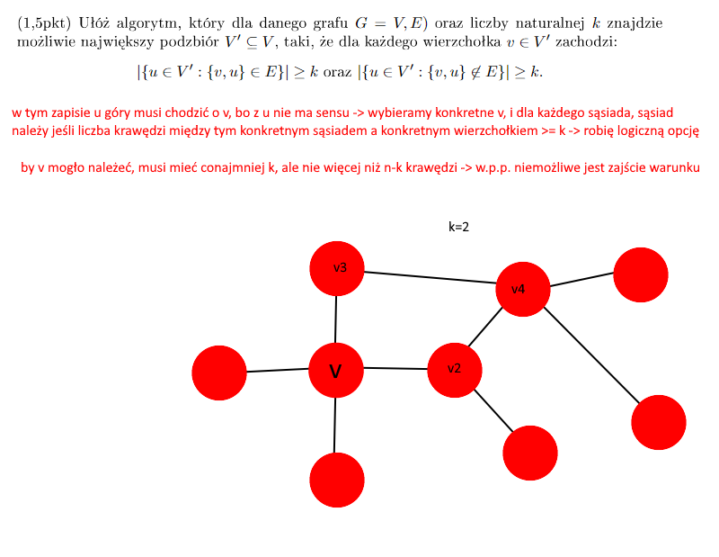

# Zadanie 5 / Lista 2
Napisz algorytm, który dla danego grafu $G = (V,E)$ oraz liczby naturalnej $k$ znajdzie możliwie największy podzbiór $V' \subseteq V$, taki, że dla każdego wierzchołka $v \in V'$ zachodzi:  

$$
|\{u \in V' : \{v,u\} \in E\}| \geq k \quad \text{oraz} \quad |\{u \in V' : \{v,u\} \notin E\}| \geq k.
$$

## Co to znaczy?

Mamy graf, chcemy wybrać jak najwięcej wierzchołków, tak by każdy z nich miał co najmniej $k$ sąsiadów w grafie oraz co najmniej $k$ nie-sąsiadów w tym samym grafie.

## Idea

### Dziwne to - dopytać