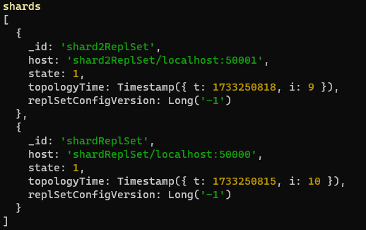
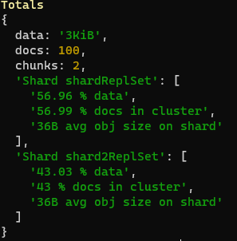

## Refer to the sharding tutorial at https://docs.mongodb.com/manual/sharding/. Prepare a small example (similar the replication one) to explain the concept.

## Sharding
Sharding divides large datasets across multiple servers (called shards) for horizontal scaling

Servers are grouped into:
- Shards: Store actual data
- Config Server: Maintains metadata about the cluster
- Mongos Router: Directs queries to the appropriate shard(s)

  
## Step by step
- Create directories
  
- Launch config server
  
```powershell
.\mongod.exe --config D:\mongo\bin\mongod-shard-config.cfg
```

- Start shards
```powershell
.\mongod.exe --config D:\mongo\bin\mongod-shard-one.cfg
```
```powershell
.\mongod.exe --config D:\mongo\bin\mongod-shard-two.cfg
```

### Initializations

- Initialize config replica set (in production at least 3 config servers should be running)  

(on mongosh:40000)
```js
rs.initiate({
  _id: "configReplSet", 
  members: [
    { _id: 0, host: "localhost:40000" }
  ]
})
```

- Initalize shards (here we could do replicas too)

(mongosh:50000)
```js
rs.initiate({
  _id: "shardReplSet",
  members: [
    { _id: 0, host: "localhost:50000" },
  ]
});
```

(mongosh:50001)
```js
rs.initiate({
  _id: "shard2ReplSet",
  members: [
    { _id: 0, host: "localhost:50001" },
  ]
});
```
### Router

- Start router

```powershell
.\mongos.exe --config D:\mongo\bin\mongod-shard-router.cfg
```

- Connect to router
```powershell
mongosh --port 60000
```

### Handle sharding

- In 60000 window, write
```js
sh.addShard("shardReplSet/localhost:50000")
sh.addShard("shard2ReplSet/localhost:50001")
```

- In 60000 window you can now test by
```js
sh.status();
```

### Test

```js
sh.enableSharding("testdb");
db.createCollection("testCollection");
sh.shardCollection("testdb.testCollection", { _id: "hashed" });
use testdb;
for (let i = 0; i < 100; i++) {
    db.testCollection.insert({ _id: i, value: `Document ${i}` });
}
```

### Check data distribution
```js
db.testCollection.getShardDistribution();
```

### Proof that it works

Setting this up uses 7 different terminals, so to be able to show solution in acceptable time i made some screenshots of this working




